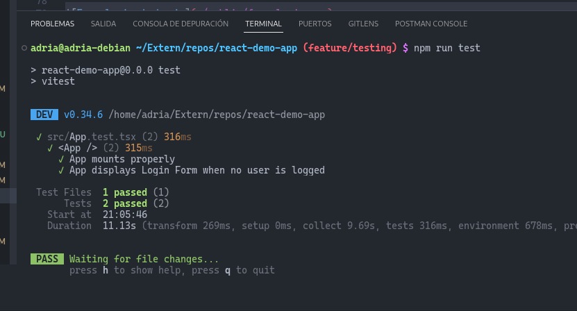
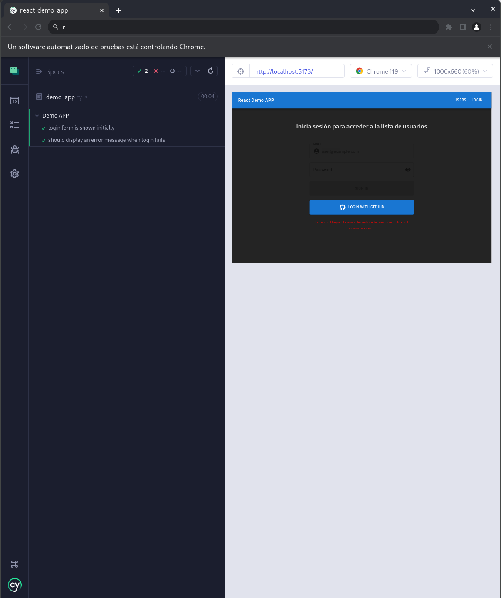
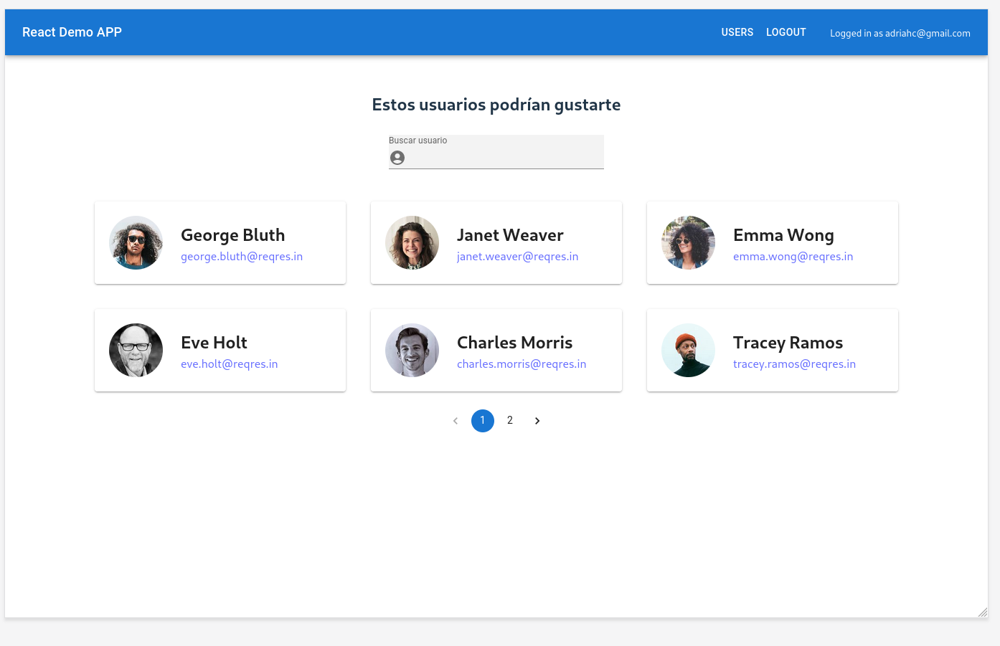
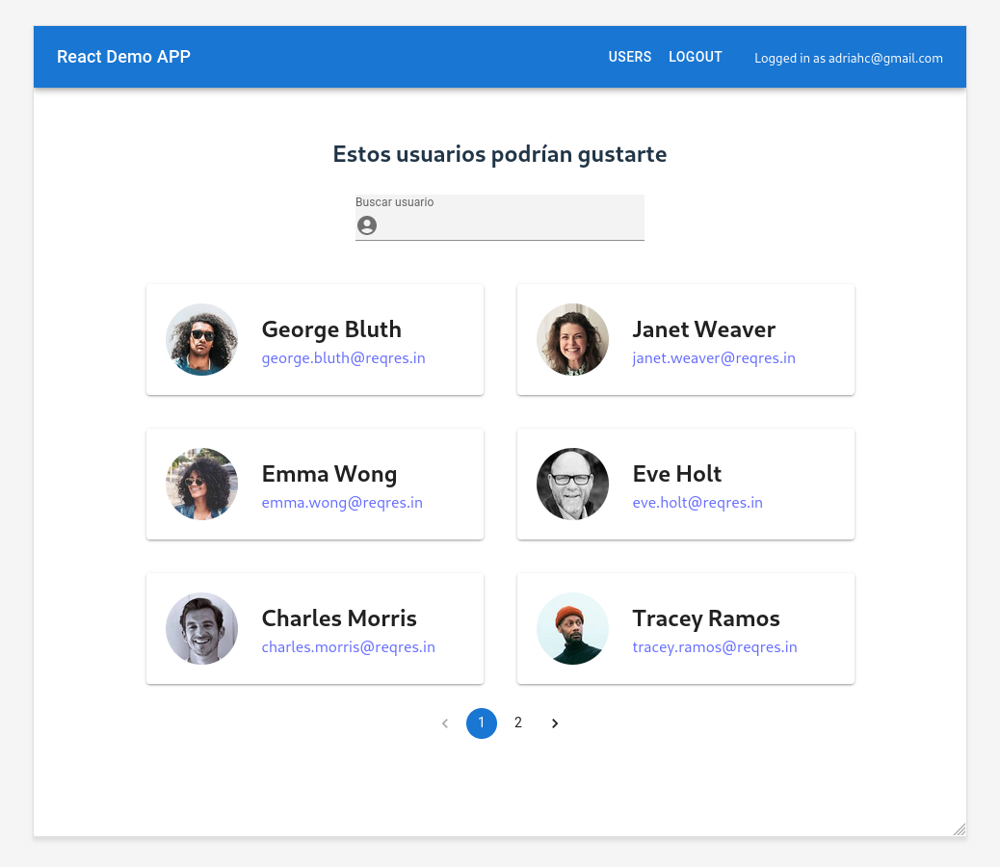
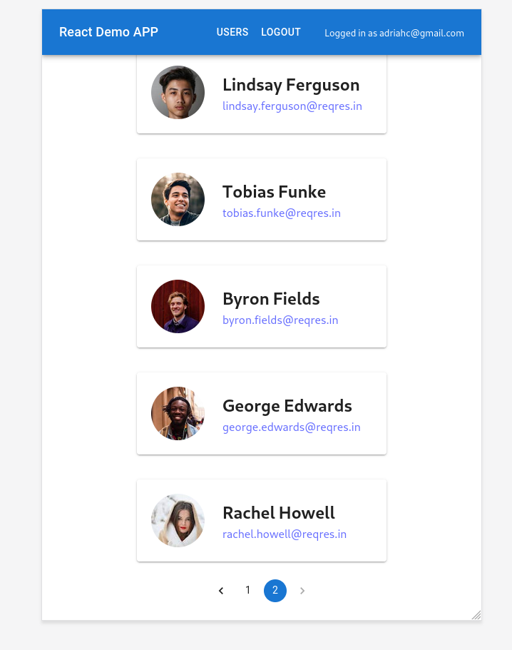
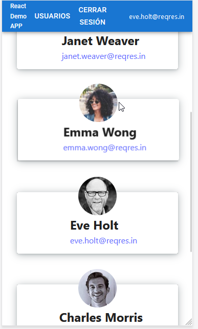
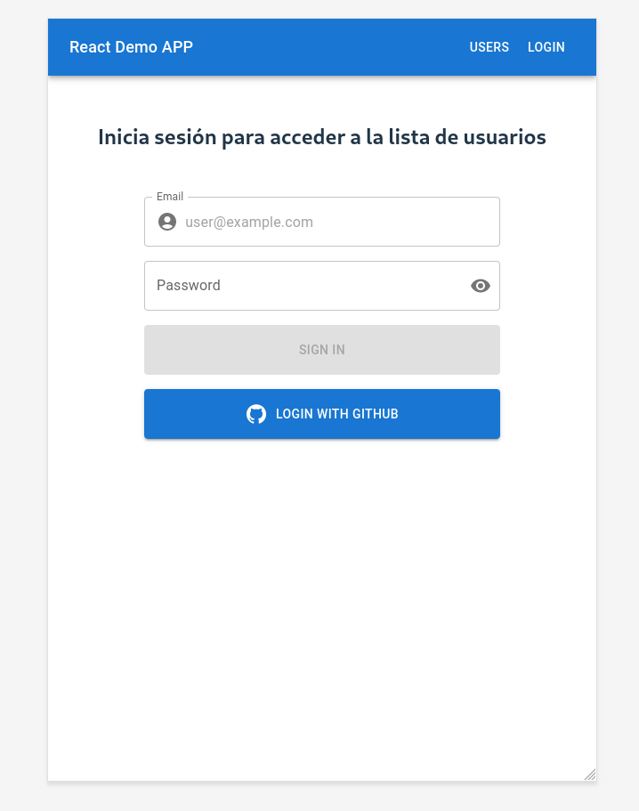
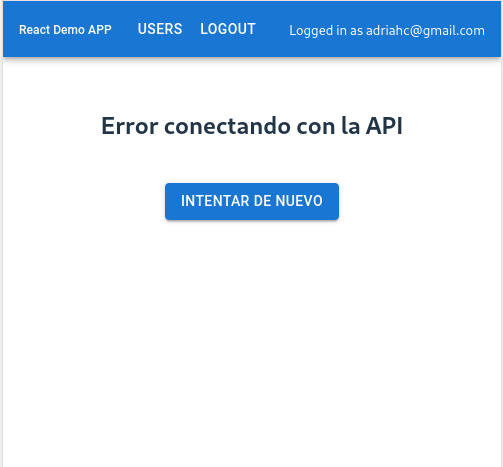

# React Demo App

Esto es una aplicación de demostración hecha con React, Vite y Typescript.

## Gestor de paquetes

Se ha utilizado PNPM como gestor de paquetes.

## Formateador de código

Se ha usado eslint como formateador de código y se ha seguido el estilo Standard de Javascript,  
desactivando algunas reglas molestas cuando se usa react (pueden verse en el fichero .eslintrc.json).

## Formulario de login

En el formulario de login no se ha implementado validación para el email y el password por simplicidad.

## Autenticación

La autenticación hace un POST a la API https://reqres.in/api/login. Para logearse se puede usar  
el email eve.holt@reqres.in con cualquier contraseña. En caso de introducir credenciales erroneas  
se muestra un mensaje de error durante 8 segundos. En caso de logearse correctamente, se guarda  
el token recibido y el email en el estado de la aplicación. Mientras exista ese token, se asume  
que el usuario está identificado. Además, se guarda esta información en localStorage para mantener  
la sesión en caso de recargar la aplicación. El Logout elimina la información del usuario tanto  
del estado global como del localStorage.

## Autenticación con GitHub. Extra

Adicionalmente, se ha añadido autenticación con GitHub mediante Firebase.

## Gestión del estado

Para gestionar el estado global se ha usado React Redux. Para mantener el estado local de los componentes  
se usa useState.

## Fetching de datos

Para hacer el fetching de datos se ha optado por React Query para poder gestionar fácilmente los estados  
de error y loading.

## Estilos

Para definir los estilos se ha utilitzado MaterialUI.

## Despliegue

La aplicación se ha desplegado en Vercel. [Link](https://react-demo-app-pink.vercel.app/)

## Testing

A modo de ejemplo, se han añadido un par de test unitarios y un par de test e2e.

### Test unitarios

- Los test unitarios se han configurado con vitest en el archivo App.test.tsx.
- El comando para ejecutarlos es npm test.

### Test e2e

- Los test e2e se han hecho con cypress en el archivo demo_app.cy.ts.
- El comando para ejecutarlos es npm run cy:run.

## CI/CD

Se ha configurado un workflow usando GitHub Actions que comprueba estilos con eslint y pasa los test  
al pushear en la rama main.

## Diseño responsivo

Para hacer un diseño responsivo se ha utilizado el componente Grid de MaterialUI basado en contenedores flex.
Así, en función del ancho de pantalla se muestran 3, 2 o 1 usuario por fila.

## Capturas de pantalla

### 3 usuarios por fila

### 2 usuarios por fila

### 1 usuario por fila

### 1 usuario por fila con pantalla ultra pequeña

### Formulario de login

### Error conectando con la API al obtener los usuarios

